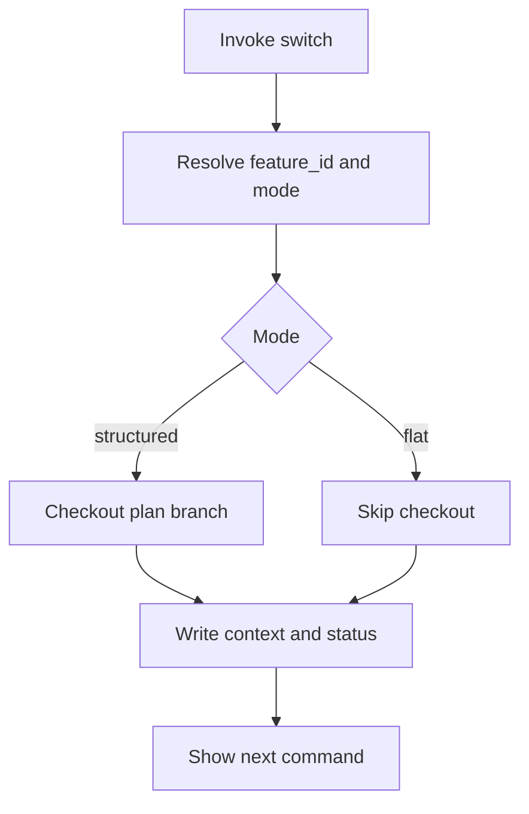
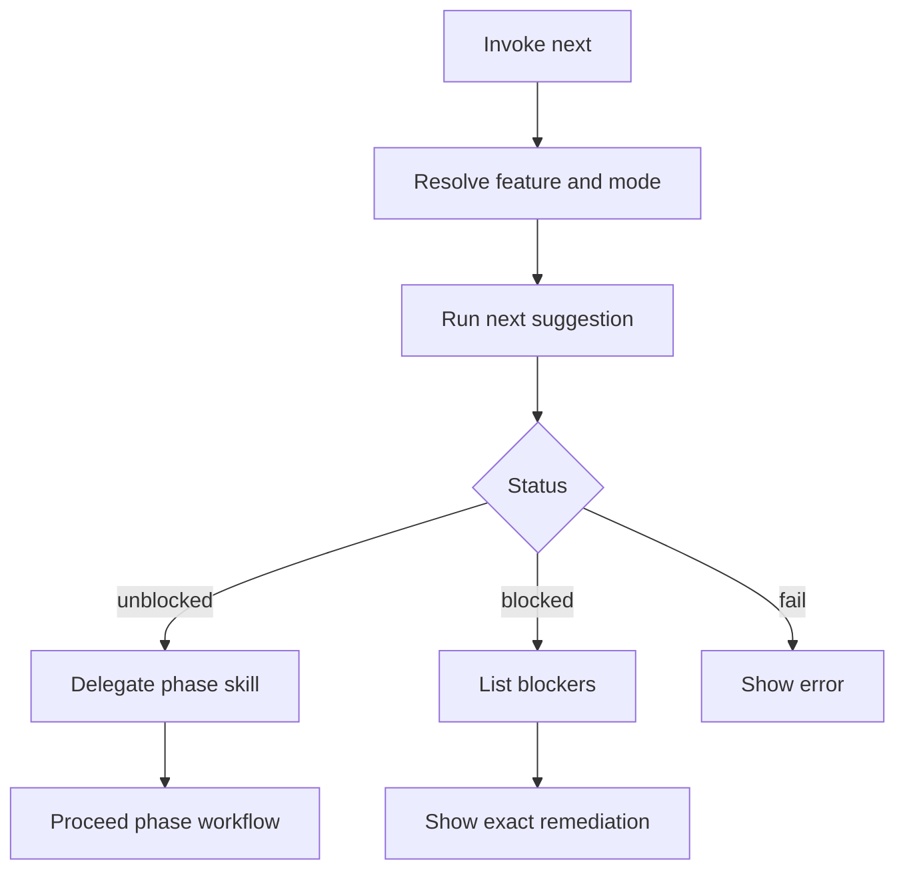
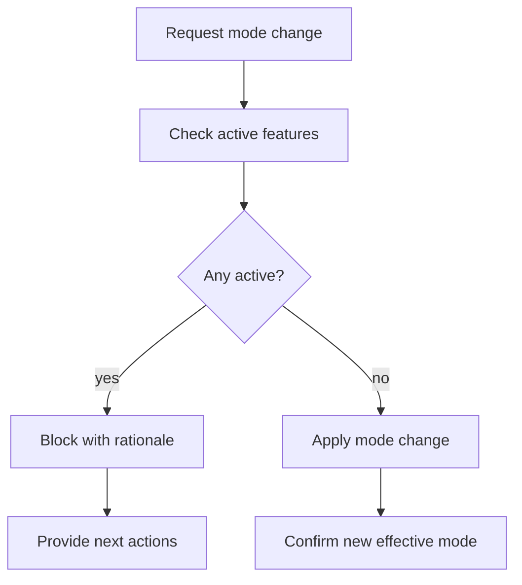

# UX Design Specification - Governance-Controlled Flat Mode (lens-dev-new-codebase-flatten)

**Author:** CrisWeber
**Date:** 2026-05-08

## Executive Summary

### Project Vision

Lens should support a governance-controlled, dual-mode control-repo workflow so teams can adopt lifecycle discipline at the right process maturity level. Structured mode remains the default and preserves current behavior; flat mode removes control-repo branch and PR enforcement while keeping lifecycle semantics, review rigor, and governance publication boundaries intact.

### Target Users

Primary users are new Lens adopters, small delivery teams, and multi-service teams that need reliable feature context without control-repo branch choreography. Secondary users are existing structured-mode teams and Lens maintainers, who need strong backward compatibility and one centralized policy resolution path.

### Key Design Challenges

The UX must clearly separate branchless control-repo workflow from reduced governance rigor, because the latter is not the intent. Mode behavior has to stay understandable across all lifecycle surfaces, including later phases that currently assume `-plan` and `-dev` branches. The design must also make governance-wide mode scope and active-feature mode-change blocking understandable without surprising users.

### Design Opportunities

Great UX can make workflow mode transparent and trustworthy by surfacing the resolved mode and its implications at decision points. The product can reduce onboarding friction by framing flat mode as an adoption accelerator, not a shortcut. It can also create a strong consistency advantage by presenting mode-aware behavior and diagnostics uniformly across switch, planning, and dev-facing flows.

## Core User Experience

### Defining Experience

The core user experience is a command-driven governance workflow where users set or inherit one effective control-repo mode and then execute lifecycle commands without UI navigation. The primary value interaction is deterministic mode-aware command behavior: users issue lifecycle commands and receive predictable results based on resolved workflow mode (`structured` or `flat`) without hidden branch assumptions.

### Platform Strategy

The platform is CLI/chat-first with docs as support context, not as the interaction surface. UX requirements prioritize low ambiguity, explicit mode visibility, and auditability in command outputs. The interaction model must work cleanly in terminal and agent-chat environments with minimal prompt friction and clear stop/continue states.

### Effortless Interactions

The most effortless interaction is running mode-sensitive commands without manual branch choreography in flat mode while preserving expected structured behavior in structured mode. Users should not have to infer why a command behaved a certain way; resolved mode and key implications should be surfaced automatically. The system should remove unnecessary confirmations when mode and feature context are already unambiguous.

### Critical Success Moments

The key success moment is when a user switches or starts feature work and the system behaves exactly as expected for the active mode with no surprise branch/PR requirements. Trust is built when later lifecycle commands (not just early planning commands) remain coherent under flat mode. The highest trust-breaking failure is silent fallback to structured-only assumptions while reporting success.

### Experience Principles

1. Mode transparency over implicit behavior.
2. Command determinism over convenience heuristics.
3. Governance rigor preserved independent of control-repo git topology.
4. Minimal interaction steps with explicit, auditable outcomes.

## Desired Emotional Response

### Primary Emotional Goals

Users should feel confident, in control, and informed at every mode-sensitive decision point. The emotional target is operational trust: users believe the tool will behave deterministically and explain outcomes clearly.

### Emotional Journey Mapping

- Discovery: users feel oriented quickly by explicit mode and phase context.
- Execution: users feel calm and productive because outputs are predictable and concise.
- Completion: users feel accomplished through clear next-step handoffs.
- Recovery: users feel supported, not blamed, when blocked or warned.
- Return usage: users feel continuity because behavior remains consistent across phases.

### Micro-Emotions

- Confidence over hesitation.
- Trust over skepticism.
- Calm over cognitive overload.
- Accomplishment over ambiguity.

### Design Implications

- Always surface resolved workflow mode before mode-sensitive outcomes.
- Pair every blocker with actionable next command guidance.
- Keep wording explicit and operational (no vague status language).
- Use consistent status grammar for pass, warning, blocked, and fail states.

### Emotional Design Principles

1. Explain first, then instruct.
2. Make safe behavior the path of least resistance.
3. Preserve momentum through clear, minimal next actions.
4. Never hide mode-driven behavior differences.

## UX Pattern Analysis & Inspiration

### Inspiring Products Analysis

Reference interaction inspirations for this command-first context:

- GitHub CLI: concise outputs with actionable follow-up commands.
- Terraform CLI: deterministic plan/apply framing and explicit state transitions.
- Azure CLI: strong command discoverability through predictable subcommand structure.

### Transferable UX Patterns

- Deterministic status header pattern: always show feature, phase, and resolved mode.
- Action-oriented diagnostics: warnings include impact plus exact remediation command.
- Progressive disclosure: show summary first, details on demand.
- Stable output schema: machine-readable fields mirrored by human-readable summaries.

### Anti-Patterns to Avoid

- Hidden branch assumptions that appear only on failure.
- Generic errors without context or recovery instructions.
- Inconsistent vocabulary across lifecycle commands.
- Overly verbose output that obscures blockers.

### Design Inspiration Strategy

Adopt CLI patterns that maximize trust and predictability, adapt them to Lens lifecycle language, and avoid any interaction that makes mode behavior implicit.

## Design System Foundation

### 1.1 Design System Choice

Use a themeable token-based system for CLI/chat output semantics and companion docs artifacts. This enables consistent status styling, mode visibility, and accessibility without imposing a visual-heavy GUI stack.

### Rationale for Selection

- Supports fast implementation with clear, reusable status tokens.
- Preserves flexibility for structured and flat-mode messaging differences.
- Keeps design language consistent across terminal output, markdown artifacts, and optional HTML aids.

### Implementation Approach

- Define semantic tokens for status, emphasis, and mode indicators.
- Apply the same message contract across all mode-sensitive commands.
- Keep formatting platform-agnostic to work in terminal and chat renderers.

### Customization Strategy

- Brand-neutral defaults with high-contrast status cues.
- Optional domain-level palette override without changing semantic meanings.
- Accessibility-first typography and spacing defaults for readability.

## 2. Core User Experience

### 2.1 Defining Experience

The defining experience is mode-aware lifecycle command execution where users always understand why the system chose a path and what to do next.

### 2.2 User Mental Model

Users expect Lens to be a strict but helpful lifecycle router: if work can proceed, proceed directly; if blocked, explain cause and next command with no guesswork.

### 2.3 Success Criteria

- Users can identify active mode and feature context immediately.
- Users can complete phase transitions without branch-model surprises.
- Users can recover from blockers using explicit remediation guidance.

### 2.4 Novel UX Patterns

This experience combines established CLI determinism with lifecycle-specific governance messaging. The novelty is policy-visible routing: mode source and lifecycle implications are treated as first-class output elements.

### 2.5 Experience Mechanics

1. Initiation: command invocation resolves feature, phase, and mode.
2. Interaction: tool executes deterministic path based on resolved policy.
3. Feedback: status line plus summary plus actionable next step.
4. Completion: explicit phase handoff or blocker list with recovery commands.

## Visual Design Foundation

### Color System

Use semantic status colors with high contrast:

- Primary context: blue.
- Success: green.
- Warning: amber.
- Error/blocker: red.
- Neutral metadata: slate.

All color usage remains semantic (meaning-first), not decorative.

### Typography System

- Base font: readable system sans stack for broad environment support.
- Hierarchy: strong section headers, concise body text, distinct code/command treatment.
- Density: compact defaults with enough line spacing for scanability.

### Spacing & Layout Foundation

- 8px spacing rhythm for markdown/docs.
- Consistent block separation for status, findings, and next actions.
- Summary-first layout: key outcome before detailed evidence.

### Accessibility Considerations

- Maintain WCAG AA contrast targets for visual artifacts.
- Avoid color-only signaling; pair with textual labels.
- Keep command examples keyboard-centric and screen-reader friendly in docs.

## Design Direction Decision

### Design Directions Explored

Six directions were evaluated in the companion HTML artifact, spanning strict audit console through lightweight guidance-first styles.

### Chosen Direction

Choose Direction 2 (Guided Terminal) as baseline with Direction 4 (Policy Lens) overlays for mode visibility.

### Design Rationale

This combination balances clarity and momentum: it keeps outputs concise while preserving explicit policy context for trust and auditability.

### Implementation Approach

- Standardize status line format.
- Embed mode and policy source in mode-sensitive flows.
- Keep detailed diagnostics collapsible/secondary.

## User Journey Flows

### Mode-Aware Feature Switch

User selects or resolves feature context, receives mode-aware switch behavior, and gets explicit next action.

### Phase Routing With Next

User invokes next, router evaluates lifecycle state, and delegates or blocks with reasons.

### Mode-Change Guard

Governance mode change attempts are safely refused when active features exist.

### Journey Patterns

- Deterministic header before operation outcome.
- Explicit mode branching with no silent fallback.
- Blockers paired with exact follow-up commands.

### Flow Optimization Principles

- Minimize prompts in unambiguous contexts.
- Preserve strictness without verbose friction.
- Keep recovery paths one step away.

## Component Strategy

### Design System Components

Use baseline components for status badges, section blocks, callouts, and command snippets.

### Custom Components

- Mode Resolution Banner: shows effective mode and policy source.
- Blocker List Card: ranked blockers with remediation commands.
- Phase Handoff Panel: current status, next command, and confidence note.
- Context Summary Strip: domain/service/feature/track snapshot.

### Component Implementation Strategy

Build custom components on top of semantic tokens so CLI/chat/docs representations remain consistent even if styling differs by renderer.

### Implementation Roadmap

- Phase 1: Mode banner, blocker card, context strip.
- Phase 2: Handoff panel and diagnostics harmonization.
- Phase 3: Refinement for cross-command consistency and edge states.

## UX Consistency Patterns

### Button Hierarchy

For command-first workflows, "button hierarchy" maps to action priority language:

- Primary action: explicit next command.
- Secondary action: optional diagnostic detail command.
- Destructive/strict action: block and explain.

### Feedback Patterns

- Success: completed plus next action.
- Warning: completed with caveat plus mitigation.
- Blocked: stopped plus numbered blockers plus commands.
- Fail: error plus minimal troubleshooting direction.

### Form Patterns

Input collection should be minimal and deterministic:

- Ask only missing required values.
- Confirm destructive actions.
- Preserve prior context when valid.

### Navigation Patterns

- Phase routing via next-style recommendation.
- Explicit skill delegation messaging.
- No hidden state inference from unrelated context.

### Additional Patterns

- Empty state: explain missing prerequisites and bootstrap command.
- Loading/progress: single concise stage line.
- Audit trail: machine-readable key fields repeated in summary.

## Responsive Design & Accessibility

### Responsive Strategy

Even as a no-UI feature, outputs must adapt across terminal widths and chat panes:

- Narrow width: summary-first, wrapped lines, shortened labels.
- Wide width: include richer context blocks.
- Keep critical guidance visible without horizontal scrolling.

### Breakpoint Strategy

Use practical output breakpoints for docs/artifacts:

- Compact: under 80 columns.
- Standard: 80-119 columns.
- Expanded: 120-plus columns.

### Accessibility Strategy

Target WCAG AA for companion visual artifacts and strong readability for text outputs:

- Non-color status labeling.
- Clear heading hierarchy.
- Keyboard-first interaction assumptions.
- Screen-reader friendly markdown structure.

### Testing Strategy

- Snapshot test mode-sensitive outputs.
- Validate blocker messages include actionable remediation.
- Test compact and wide output formats.
- Run contrast and semantic checks on HTML companion files.

### Implementation Guidelines

- Keep status grammar consistent across commands.
- Use semantic tokens, not hardcoded style assumptions.
- Prefer concise wording with explicit action verbs.
- Ensure every stop condition includes a clear next step.