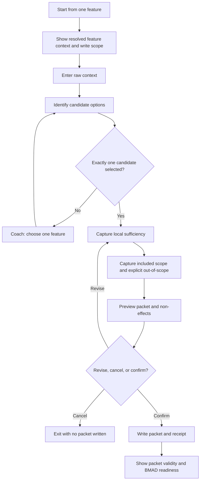
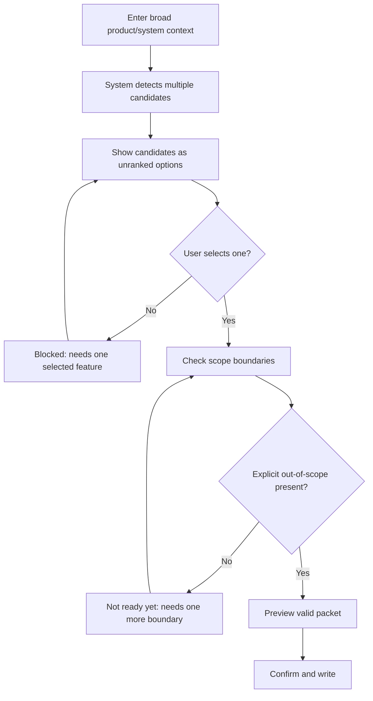
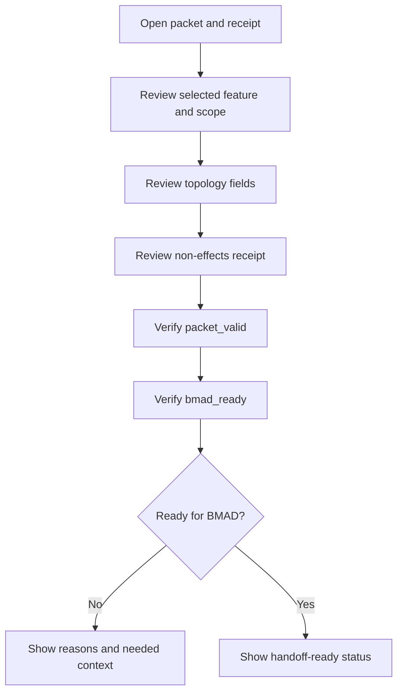
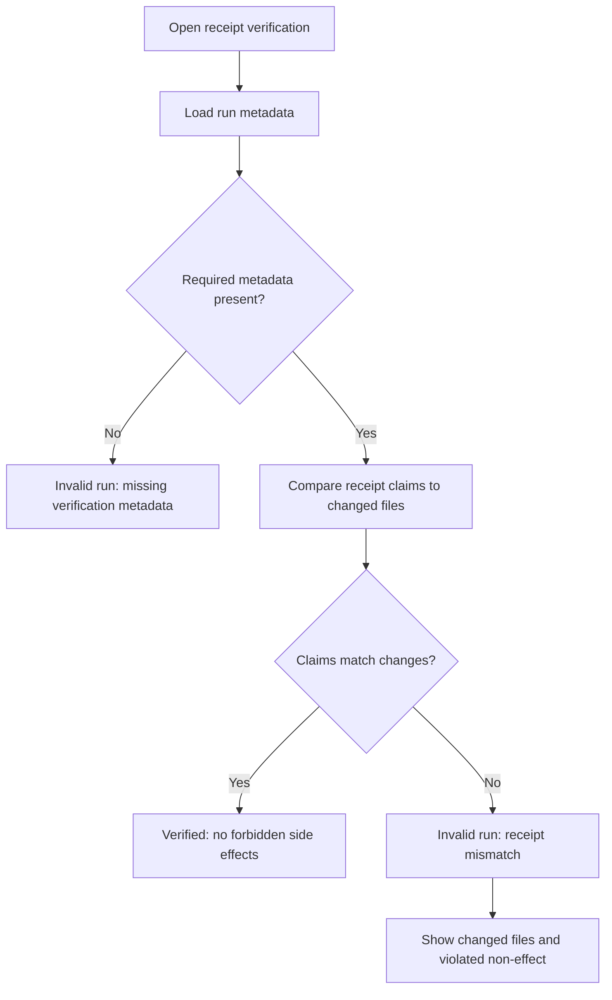

# UX Design Specification - Bottom-Up LENS Feature Packet Creator

**Author:** BMad
**Date:** 2026-05-19

---

<!-- UX design content will be appended sequentially through collaborative workflow steps -->

## Executive Summary

### Project Vision

Bottom-Up LENS Feature Packet Creator gives operators a safe, governed way to start from one useful feature. The experience should communicate: “One feature is enough, and NextLens will not pretend you know more.” The UX must make restraint visible through candidate selection, sufficiency checks, explicit out-of-scope, preview confirmation, and a non-effects receipt.

The target emotional state is relief: users should feel the product is protecting their uncertainty, not interrogating them.

### Target Users

- **Individual builders** who know one useful feature but not the surrounding system.
- **Product/engineering teams** exploring early feature slices without mature architecture.
- **Lens/BMAD operators** who need governed packet capture and handoff clarity.
- **Support/QA users** who verify packet safety and receipt claims.
- **Read-only reporting consumers** who need status visibility without mutation authority.

### Key Design Challenges

- Make “bottom-up” understandable through “Start from one feature” language.
- Prevent users from accidentally capturing a system, roadmap, or architecture.
- Keep blocking moments protective rather than punitive.
- Distinguish packet validity from BMAD readiness in plain language, such as “Feature packet is valid” and “Ready for BMAD: not yet / ready.”
- Make non-effects visible and trustworthy without requiring topology expertise.
- Preserve confidence while telling users “not yet” when constraints fail.

### Design Opportunities

- Create a “minimum viable restraint loop” that feels like guided focus, not bureaucracy.
- Use preview as the pre-write value moment where trust is earned: selected feature, included scope, out-of-scope, assumptions, write target, and non-effects in one compact review.
- Turn validation errors into coaching that helps users slice, bound, or clarify.
- Make the receipt a reassuring proof artifact, not an implementation detail.
- Use read-only status language that reinforces Archive evidence vs promoted Landscape truth.

## Core User Experience

### Defining Experience

The defining experience is a focused packet-creation loop:

1. Start from one feature.
2. Provide raw context.
3. Confirm exactly one candidate.
4. Answer only local sufficiency and scope-safety prompts.
5. Review a compact preview.
6. Confirm write.
7. Receive a non-effects receipt.

The experience succeeds when the operator feels the product narrowed the work safely without forcing premature hierarchy.

### Platform Strategy

- Primary surface: existing Lens/NextLens command or prompt workflow in the developer/operator environment.
- Interaction mode: keyboard-first, text-first, with structured prompts and review screens.
- Output mode: markdown/structured artifact review plus visible validation and receipt surfaces backed by machine-readable packet/receipt artifacts.
- Offline behavior: no network dependency should be required for packet validation if source context and feature metadata are local.
- Accessibility baseline: plain-language prompts, clear headings, deterministic menus, and no reliance on color-only status.

### Effortless Interactions

- Starting from plain language raw context.
- Seeing candidate options without interpreting them as priorities.
- Understanding why one candidate must be selected.
- Adding out-of-scope items without feeling like scope is being lost.
- Seeing at a glance what will and will not be written.
- Understanding `Feature packet is valid` vs `Ready for BMAD: not yet`.

### Critical Success Moments

- The first time the user sees “Start from one feature” and understands they do not need a system.
- The candidate selection moment, where multiple ideas become one safe feature.
- The scope-boundary moment, where out-of-scope becomes protection.
- The preview moment, where trust is earned before write.
- The receipt moment, where non-effects are visible and verifiable.

### Experience Principles

- **Restraint is reassurance:** every block should feel protective.
- **One feature, no fiction:** keep the user focused on local value.
- **Progressive disclosure:** show only the next safety decision, not the entire topology model.
- **Preview earns trust:** do not write until the user sees the packet and non-effects.
- **No surprise writes:** every write target and non-effect must be visible before confirmation.
- **Plain-language gates:** avoid topology jargon when explaining validity and readiness.
- **Evidence is not promotion:** report status without implying Landscape or Graph truth.

## Desired Emotional Response

### Primary Emotional Goals

- **Relief:** “I can start from one feature without inventing a whole system.”
- **Permission:** “It is acceptable that I do not know the full system yet.”
- **Confidence:** “The packet is bounded, valid, and safe to save.”
- **Trust:** “NextLens shows what it will write and proves what it will not change.”
- **Focus:** “The product keeps me on one useful feature.”
- **Control:** “I can revise, cancel, or confirm before any write occurs.”

### Emotional Journey Mapping

- **Entry:** The user feels invited, not underprepared, because the entry point says “Start from one feature.”
- **Candidate selection:** The user feels focused as messy context becomes one selected candidate, with positive feedback that narrowing is progress.
- **Sufficiency prompts:** The user feels guided, not interrogated, because questions explain why each answer protects the packet.
- **Out-of-scope capture:** The user feels safer because excluded work is preserved as boundaries, not lost value.
- **Preview:** The user feels trust before write because validity, write target, and non-effects are visible.
- **Receipt:** The user feels confident because the result is verifiable.
- **Blocked states:** The user feels protected and coached, not punished; copy should say “not ready yet” or “needs one more boundary” instead of “failed” where possible.

### Micro-Emotions

- Replace ambiguity with clarity.
- Replace pressure to invent topology with permission to stay local.
- Replace fear of losing adjacent ideas with confidence that deferred candidates are preserved as notes.
- Replace skepticism about “no side effects” with verifiable proof.
- Replace failure frustration with actionable correction.

### Design Implications

- Use calm, direct copy that explains protective intent.
- Keep each step focused on one decision.
- Label status in plain language before exposing technical terms.
- Show “will write” and “will not write” together.
- Use validation messages as coaching prompts.
- Make confirmation explicit and deliberate.
- Provide positive reinforcement when the user narrows from many possible candidates to one selected feature.

### Emotional Design Principles

- **Protect uncertainty.**
- **Coach before blocking.**
- **Make restraint visible.**
- **Reward narrowing.**
- **Prove safety.**
- **Never surprise-write.**

## UX Pattern Analysis & Inspiration

### Inspiring Products Analysis

- **Git commit/diff preview:** Shows exactly what will change before the user commits. Relevant pattern: write confidence through explicit before/after review.
- **GitHub pull request checks:** Separates “changes exist” from “checks pass.” Relevant pattern: clear readiness labels, blocking checks, and fix guidance.
- **CLI dry-run workflows:** Let users inspect intended effects before mutation. Relevant pattern: preview, confirm, then write.
- **Linting and diagnostics:** Point users to exact issues and fix actions. Relevant pattern: blockers as precise guidance rather than generic failure.
- **Wizard-style setup flows:** Reduce cognitive load by asking one decision at a time. Relevant pattern: progressive disclosure.
- **CI/test reports:** Make success and failure verifiable. Relevant pattern: receipt-like evidence with reproducible status.
- **Machine-readable command output:** Provides both human-readable status and parseable output. Relevant pattern: visible receipt plus structured receipt.

### Transferable UX Patterns

- **Preview before mutation:** Show selected feature, scope, out-of-scope, assumptions, write target, and non-effects before write.
- **Checks as coaching:** Display blockers as “needs one more boundary” or “not ready yet,” with a fix action.
- **Two-state readiness:** Use separate plain-language labels for packet validity and BMAD readiness.
- **Dry-run mental model:** Make preview feel safe because nothing has been written yet.
- **Receipt as proof:** Treat receipt output as a visible user artifact, not only a log.
- **Dual-mode status:** Provide compact human-readable state and parseable receipt/status output.

### Anti-Patterns to Avoid

- **Wizard fatigue:** Too many prompts can make restraint feel bureaucratic.
- **False green checks:** Do not show success unless side effects are verifiably absent.
- **Topology jargon too early:** Avoid making users understand Archive/Landscape/Graph before they can create a packet.
- **Ambiguous “draft saved” states:** Do not imply a valid packet exists before hard gates pass.
- **Hidden writes:** Never mutate secondary artifacts silently.
- **Critical state buried in logs:** Users should not need logs to know whether packet creation was safe.

### Design Inspiration Strategy

- Adopt diff-preview confidence for write review.
- Adopt PR-check clarity for readiness and blockers.
- Adapt dry-run patterns for packet preview and verification.
- Adapt lint-style diagnostics for precise fix guidance.
- Adapt wizard patterns for progressive safety decisions.
- Provide both visible human status and machine-readable receipt output.
- Avoid consumer-style delight that obscures governance seriousness.

## Design System Foundation

### 1.1 Design System Choice

Use an **operator workflow design system** aligned with existing Lens/NextLens command, prompt, and artifact conventions. Do not introduce a separate visual UI design system for the MVP.

### Rationale for Selection

- The MVP lives in a developer/operator workflow, not a standalone web or mobile UI.
- Consistency with existing Lens prompts and artifacts is more important than visual uniqueness.
- The core UX depends on structured decisions, clear copy, validation states, and receipt readability.
- A lightweight interaction system reduces implementation overhead and keeps attention on safety gates.

### Implementation Approach

Define reusable patterns for:

- Entry prompt: “Start from one feature.”
- Candidate selection list.
- Sufficiency question blocks.
- Scope and out-of-scope capture.
- Preview screen.
- Confirmation action/token.
- Validation status summary.
- Non-effects checklist.
- Receipt summary.
- Blocker/fix guidance.

Each user-visible state should pair human-readable wording with machine-readable state where a downstream validator or receipt depends on it.

### Customization Strategy

- Use consistent labels: `Feature packet is valid`, `Ready for BMAD: not yet`, `Ready for BMAD: ready`.
- Use consistent status categories: valid, not ready yet, blocked, confirmed, written, verified.
- Use tone tokens: protective, precise, calm, encouraging.
- Keep topology terms secondary and explanatory.
- Use structured markdown for human-readable outputs and parallel machine-readable output for receipts.
- Reuse Lens frontmatter and artifact conventions where applicable.

### Blocker Message Template

Blocker messages should include:

1. **Why blocked:** the safety rule that was not satisfied.
2. **What to do next:** the smallest corrective action.
3. **What will not be written:** reassurance that no packet or downstream topology was created.

## 2. Core User Experience

### 2.1 Defining Experience

The defining experience is: **turn messy raw context into one confirmed feature packet without surprise writes or false topology**.

Users should describe it as: “I gave NextLens one messy idea, it helped me select one useful feature, showed exactly what would be saved, and proved nothing else changed.”

### 2.2 User Mental Model

Users arrive with one of three mental models:

- **Idea capture:** “I have a useful feature idea and need to save it.”
- **Planning intake:** “I need enough structure to hand this to BMAD.”
- **Safety review:** “I need proof this did not create hidden topology.”

The UX should meet the user at “idea capture” and progressively reveal planning/safety concepts only when needed.

Likely confusion points:

- Thinking multiple candidates can become a packet together.
- Treating deferred candidates as roadmap items.
- Confusing “valid packet” with “ready for BMAD.”
- Assuming packet creation updates Landscape or Graph.

### 2.3 Success Criteria

The core experience succeeds when:

- The user can start without naming a system.
- The user selects exactly one feature candidate.
- The user understands why out-of-scope is required.
- The preview makes write target and non-effects clear.
- The user can run preview/dry-run without writing anything.
- The user can revise inputs from preview before confirming.
- The user confirms deliberately.
- The receipt verifies no forbidden downstream effects.
- The user understands next state: valid, not ready yet, or ready.

### 2.4 Novel UX Patterns

The UX combines established patterns in a novel governance context:

- **Dry-run preview** adapted to planning artifacts.
- **PR-check readiness** adapted to packet validity/BMAD readiness.
- **Lint-style blocker guidance** adapted to product scoping.
- **Receipt proof** adapted to non-effects and topology safety.
- **Progressive disclosure** adapted to anti-expansion governance.

### 2.5 Experience Mechanics

**Initiation**

- User selects “Start from one feature.”
- System shows resolved feature context, output path, and write scope.
- System asks for raw context.

**Interaction**

- System identifies candidate options for user confirmation.
- User selects one candidate.
- System asks sufficiency and scope prompts.
- User adds included scope, explicit out-of-scope, assumptions, and acceptance criteria.

**Feedback**

- System shows blockers as protective guidance.
- System labels status plainly: `Feature packet is valid`, `Ready for BMAD: not yet`, or `Ready for BMAD: ready`.
- System shows “will write” and “will not write.”
- System supports preview/dry-run output with no write side effects.

**Preview Edit Loop**

- User can return from preview to candidate selection, sufficiency prompts, or scope boundaries.
- The product preserves answered context while allowing correction.
- No packet is written until the user confirms after the revised preview.

**Completion**

- User confirms with explicit action/token.
- System writes packet and receipt.
- System shows receipt summary and packet/BMAD readiness status.
- Packet creation does not automatically trigger BMAD execution.

## Visual Design Foundation

### Color System

- Use existing Lens/VS Code/terminal color semantics where available.
- Do not rely on color alone for status.
- Map status visually and textually:
  - `valid`: success color + “Feature packet is valid”
  - `not ready yet`: neutral/warning color + clear next action
  - `blocked`: warning/error color + protective reason + fix action
  - `written`: success color + write target
  - `verified`: success color + receipt verification summary
- Avoid celebratory colors that make governance checks feel casual.

### Typography System

- Use existing editor/terminal typography.
- Prefer concise headings, bullet lists, and labeled sections.
- Use paths in backticks, bold visible status labels, and monospace for schema fields, status tokens, and command/action tokens.
- Keep long explanations collapsible or secondary in generated artifacts where possible.
- Optimize for scanning under developer workflow conditions.

### Spacing & Layout Foundation

- Use compact, structured layout optimized for text workflows.
- Group related decisions into blocks:
  - Context
  - Candidate
  - Sufficiency
  - Scope
  - Preview
  - Non-effects
  - Confirmation
  - Receipt
- Use a three-tier information hierarchy:
  1. Primary status: what state the packet/run is in.
  2. Secondary explanation: why that state exists.
  3. Tertiary technical detail: paths, fields, changed files, and schema data.
- Use whitespace to separate gates and prevent accidental confirmation.
- Keep primary action and safety warning visually adjacent.

### Accessibility Considerations

- Every status must have text, not only color.
- Menus must be keyboard-friendly and deterministic.
- Headings must be descriptive and ordered.
- Error/blocker messages must include next action.
- Receipt and validation summaries must be readable in plain text and machine-parseable form.
- Verification output should include a checked-files summary so receipt trust is visible without opening logs.

## Design Direction Decision

### Design Directions Explored

1. **Checklist Gate Flow:** A compact sequence of gates with check-style status for each safety requirement.
2. **Diff Preview Flow:** A preview-first direction that emphasizes “will write / will not write.”
3. **Wizard Coach Flow:** A guided sequence that asks one safety decision at a time with supportive explanations.
4. **Receipt-Led Flow:** A direction where the final proof artifact is visually central.
5. **Diagnostics Flow:** A lint-style direction where blockers point to exact fields and fixes.

### Chosen Direction

Use a **Wizard Coach + Diff Preview hybrid**.

The user moves through one decision at a time, then reaches a compact preview that shows the packet and non-effects before write. Diagnostics and receipt patterns support the flow but do not dominate it. The receipt acts as closing reassurance after write, not as the main navigation object.

### Design Rationale

- Wizard coaching supports emotional goals: relief, permission, focus, and confidence.
- Diff preview supports trust: users see write target and non-effects before confirmation.
- Preview should mirror the same fields that will appear in the packet and receipt so the user-visible state cannot drift from the written artifact.
- Diagnostics support safe correction without punitive blocking.
- Blockers should appear at the gate where they can be fixed, not accumulate only at the end.
- Receipt-led proof supports post-write confidence and support/QA verification.

### Implementation Approach

- Structure the experience around progressive gates.
- Use the preview as the primary trust surface.
- Use diagnostics for inline blockers and fix guidance.
- Use receipt summary as the final verification surface.
- Avoid a dashboard-style UI in MVP; keep the workflow command/prompt-native.

## User Journey Flows

### Flow 1: Ari Captures One Honest Feature

### Flow 2: Morgan Is Blocked From Capturing A System

### Flow 3: Riley Audits Packet Safety

### Flow 4: Quinn Verifies A Receipt Claim

### Journey Patterns

- Every flow begins by showing context and write scope before mutation.
- Candidate flows preserve deferred ideas without ranking them.
- Blockers appear at the point of fix.
- Preview supports revise, cancel, or confirm.
- Completion reports packet validity and BMAD readiness separately.
- Packet creation completion never auto-advances to BMAD execution.
- Verification flows include checked files and violated non-effects.

### Flow Optimization Principles

- Minimize steps before the user sees candidate options.
- Keep each prompt focused on one decision.
- Use “not ready yet” language for recoverable blockers.
- Never require users to understand topology before they can act.
- Keep dry-run/preview available until confirmation.

## Component Strategy

### Design System Components

The MVP uses command/prompt-native components rather than visual UI widgets:

- Menu prompt
- Confirmation prompt
- Status summary
- Progress indicator
- Markdown section
- Bullet list
- Code/path token
- Validation message
- Artifact link/path reference

### Custom Components

#### Start From One Feature Entry

**Purpose:** Invite users into the bottom-up flow without requiring topology knowledge.  
**Usage:** First visible entry point.  
**Anatomy:** title, short promise, expected input, no-surprise-write reassurance.  
**States:** ready, missing context, unavailable.  
**Accessibility:** clear heading and keyboard-selectable action.  
**Content Guidelines:** use “Start from one feature” before “Bottom-Up LENS.”

#### Progress Indicator

**Purpose:** Show where the user is in the safety loop.  
**Usage:** At each major gate.  
**Anatomy:** current step, completed steps, next step.  
**States:** in progress, blocked, complete.  
**Accessibility:** text labels only; no color-only progress.  
**Content Guidelines:** use concise labels such as Candidate, Sufficiency, Scope, Preview, Receipt.

#### Candidate Selection List

**Purpose:** Let users choose exactly one feature candidate.  
**Usage:** After raw context intake.  
**Anatomy:** candidate label, one-line value, optional evidence snippet, deferred-note option.  
**States:** none selected, one selected, too many selected.  
**Accessibility:** deterministic options and clear selected state.  
**Content Guidelines:** never imply priority, roadmap, or dependency order.

#### Sufficiency Prompt Block

**Purpose:** Gather local value, actor, problem, acceptance criteria, constraints, and assumptions.  
**Usage:** After candidate selection.  
**Anatomy:** question, why it matters, answer field, examples, skip/unknown rules.  
**States:** unanswered, answered, intentionally unknown, blocked.  
**Accessibility:** one question per block.  
**Content Guidelines:** explain how each answer protects the packet.

#### Scope Boundary Block

**Purpose:** Capture included scope and explicit out-of-scope.  
**Usage:** Before preview.  
**Anatomy:** included scope list, out-of-scope list, deferred candidates note.  
**States:** complete, missing included scope, missing out-of-scope.  
**Accessibility:** list format with clear labels.  
**Content Guidelines:** frame out-of-scope as protection, not loss.

#### Packet Preview Panel

**Purpose:** Earn trust before write.  
**Usage:** Final pre-write review.  
**Anatomy:** packet summary, write target, validity, BMAD readiness, non-effects checklist, confirmation action.  
**States:** valid, not ready yet, blocked, ready to confirm.  
**Accessibility:** headings and plain-language status.  
**Content Guidelines:** mirror packet/receipt fields.

#### Non-Effects Receipt Summary

**Purpose:** Confirm and verify what did not happen.  
**Usage:** After write and during verification.  
**Anatomy:** receipt status, checked files, emitted side-effect booleans, mismatch details if any.  
**States:** verified, mismatch, missing metadata.  
**Accessibility:** parseable and readable.  
**Content Guidelines:** never bury critical state in logs.

#### Blocker Message

**Purpose:** Coach users through safety failures.  
**Usage:** At the gate where a fix is possible.  
**Anatomy:** why blocked, what to do next, what was not written.  
**States:** recoverable, hard stop.  
**Accessibility:** concise and specific.  
**Content Guidelines:** use “not ready yet” when recoverable.

### Component Implementation Strategy

- Implement components as reusable prompt/output patterns first.
- Pair human-readable output with machine-readable state for validation and receipts.
- Use explicit machine state keys where relevant, such as `packet_valid`, `bmad_ready`, and `receipt_verified`.
- Keep components small and composable across gates.
- Ensure every blocker component includes a fix action.
- Reuse status labels and tone tokens consistently.
- Ensure every component remains understandable if copied into a markdown artifact.

### Implementation Roadmap

**Phase 1 - Core Components**

- Start From One Feature Entry
- Progress Indicator
- Candidate Selection List
- Sufficiency Prompt Block
- Scope Boundary Block
- Packet Preview Panel
- Blocker Message
- Non-Effects Receipt Summary

**Phase 2 - Supporting Components**

- Packet/BMAD readiness comparison summary
- Receipt verification details
- Deferred candidate note summary

**Phase 3 - Enhancement Components**

- Read-only reporting card
- Promotion suggestion review component
- Adjacency evidence summary

## UX Consistency Patterns

### Action Hierarchy

**When to Use:** Every gate with user choice.  
**Behavior:** One primary next action, one safe back/revise action, one cancel/stop action when write is possible.  
**Accessibility:** All actions must be keyboard-selectable and text-labeled. Menus should use deterministic labels or numbering so choices are testable and repeatable.  
**Variants:**

- Primary: continue/confirm selected action.
- Secondary: revise/back.
- Destructive/safety: cancel/stop, always no-write unless explicitly stated.

### Feedback Patterns

**Success:** State what is valid/written/verified and include the relevant path or receipt.  
**Positive narrowing:** Confirm that selecting one feature is progress and that deferred ideas are preserved as notes, not lost.  
**Incomplete:** Use when the user still needs to answer or bound something; avoid calling this an error.  
**Not Ready Yet:** State the missing boundary or answer and show the next fix.  
**Blocked:** State the violated safety rule, why it protects the user, and what was not written.  
**Invalid:** Reserve for verified contradictions, false receipt claims, or hard safety failures.  
**Info:** Explain topology or readiness concepts only when needed.  
**Verification Mismatch:** Show mismatched claim, checked files, and violated non-effect.

### Form and Prompt Patterns

- Ask one decision per prompt.
- Explain why each answer is needed.
- Distinguish empty, unknown, and intentionally deferred.
- Provide examples only when they reduce ambiguity.
- Preserve answered context when the user returns from preview.

### Navigation Patterns

- Linear progression through gates by default.
- Allow explicit return from preview to candidate, sufficiency, or scope steps.
- Do not allow hidden jumps to write.
- Use progress labels: Context → Candidate → Sufficiency → Scope → Preview → Receipt.

### Preview Patterns

- Preview mirrors packet and receipt fields.
- Show “will write” and “will not write” together.
- Show packet validity and BMAD readiness separately.
- Show confirmation action/token only after all hard blockers are cleared.
- Provide dry-run/no-write mode.

### Receipt and Verification Patterns

- Show receipt summary immediately after write.
- Include checked-files summary during verification.
- Pair human-readable receipt summary with machine-readable receipt content.
- Mark receipt mismatch as invalid, not warning-only.
- Never require log inspection for primary safety state.

### Additional Patterns

- Use “Start from one feature” as the primary entry label.
- Use “not ready yet” for recoverable blockers.
- Use topology terms only as secondary explanation.
- Treat deferred candidates as notes, never as a backlog or roadmap.

## Responsive Design & Accessibility

### Responsive Strategy

The MVP is command/prompt-native and text-first, so responsiveness means adapting to editor, terminal, and artifact-reading contexts rather than web breakpoints.

- **Wide/editor view:** show full preview sections with context, packet summary, non-effects, and confirmation visible in one reading flow.
- **Narrow/terminal view:** preserve the same order but keep sections compact and line-wrappable.
- **Artifact view:** generated markdown should remain readable in VS Code preview, GitHub markdown, terminal cat output, and plain-text review.
- **No dashboard dependency:** UX must work without a browser UI.

### Breakpoint Strategy

No custom visual breakpoints are required for the MVP. Use content breakpoints instead:

- Short labels for inline status.
- Section headings for scan boundaries.
- Bullets over tables when narrow readability matters.
- Tables only for receipt/check summaries where alignment improves comprehension.
- Machine-readable output separate from human-readable wrapping.

### Accessibility Strategy

- Target WCAG AA principles where applicable to text and command surfaces.
- Do not rely on color-only status.
- Keep menus deterministic and keyboard-friendly.
- Use descriptive headings and explicit action labels.
- Keep status phrasing plain: valid, not ready yet, blocked, written, verified.
- Avoid jargon-first messages.
- Provide first-use plain-language definitions for terms such as Archive, Landscape, Graph, and BMAD readiness.
- Reduce memory burden by repeating the current selected candidate and write target at later gates.
- Ensure markdown artifacts remain useful with screen readers and text-only tools.

### Testing Strategy

- Test keyboard-only operation for all prompt menus.
- Test plain-text readability in terminal output.
- Test markdown preview readability.
- Test heading order and screen-reader-friendly markdown structure.
- Test status comprehension without color.
- Test long paths and wrapped lines.
- Test blocker copy for “why blocked / what next / what was not written.”
- Test receipt verification summaries for checked-file visibility.

### Implementation Guidelines

- Prefer semantic markdown headings and lists.
- Keep line lengths reasonable where generated output is controlled.
- Provide both human-readable and machine-readable status.
- Put primary status before technical detail.
- Use paths in backticks.
- Ensure every prompt has a clear exit/cancel path before write.
- Keep confirmation deliberate and not adjacent to destructive-looking text.