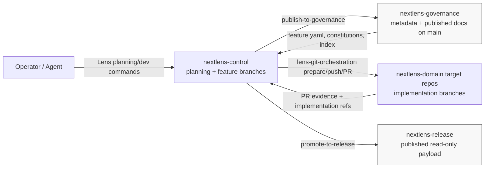

# TopDownLens Self-Hosting Topology

Governance and release are protected publication surfaces. Control branches stage planning and dev artifacts, while target repos carry implementation work. All cross-repo mutation flows through approved orchestration boundaries.